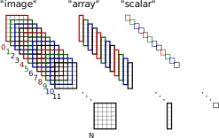
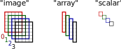
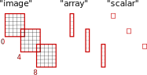

Core Concepts
=============

Here we explain how, to our perception, scientific data analysis generally
takes place, what are the most challenging aspects in the typical workflow,
and how nx5d intends to
[scratch that itch](http://www.catb.org/~esr/writings/cathedral-bazaar/cathedral-bazaar/ar01s02.html).

If you're looking to dive right in, skip to the
[Quick Start](user-guide/index.md#quick-start) page and the rest of the
[User Guide](user-guide/index.md).
You can return to this section at a later point if you feel inclined.

Motivation
----------

### Typical Workflows


To us, the typical workflow of scientists regarding their data
involves the following steps:

1. **Measurement** -- i. e. acquiring data by specific measurement instruments
   (detector images, temperature values, flow magnitudes), possibly accompanied
   by additional data items *not* necessarily of primary interest, but necessary
   for processing and understanding the primary data (positioning values like
   angles, energies, distances etc).
   
2. **Reading** -- the actual step of opening the files in an analysis
   environment (e. g. Python, likely inside a
   [Jupyter Lab](https://jupyterlab.readthedocs.io/en/latest/index.html) environment),
   parsing *all* the relevant data including positioners, and generating useful
   language objects (e. g. [Numpy arrays](https://numpy.org/doc/stable/))
   to interact with it.

3. **Processing** -- this is the "core" of data analysis process: translating the
   data from its machine-generated form (e. g. detector images with pixels and
   associated angles) into a form closer to the actual science to be performed (e. g.
   "energy distribution map by crystal momentum coordinates").
   
4. **Presentation** -- many activities fall into this category, for instance
   writing a paper intended for (peer-reviewed) publication, designing a conference
   poster, creating a presentation for group-internal review etc; but all of these
   actually begin with the benign task of just *plotting* the data, i. e. visualising
   it, mostly still within the same processing enviroment as previous steps, with
   the help of a designated library like [Matplotlib](https://matplotlib.org/).
   
The essential message behind this breakdown is that by the time step 4 is reached,
the data-processing part of a scientists's job is done; and that every part of
that job, which is *specific* to a certain scientist and a certain experimental
setup, is already finished after step 1.

Conversely, as far as steps 2 and 3 are concerned -- reading and processing of
experimental data -- there is a lot of potential for "joining forces" among
scientists. Yet ironically, this is what swallows up a large amount of time and
energy of every PhD's and postdoctoral researcher's time.


### If Data Analysis Was a Picnic...

...at a leisurely pace, and in a programming language resembling Python code,
the typical workflow for loading, preparing and visualising the latest
measurement data should look similar to this:

```
# Initialisation of experiment specific preparations and definitions.
experiment_setup = initialize_experiment_parameters()

# Data input, identifying the specific data set we're interested in
raw_data = DataSouce("url/of/data").read(scanReference="...")

# Transforming data into a more "physical" coordinate system, possibly
# while accounting for background signal, noisy detectors etc.
# This is obviously an involved step, but it should, none the less, only
# involve the original data and experiment-specific parameters.
transformed_data = data_transformation(raw_data, experiment_setup)

# Finally, the data can be displayed as desired.
pyplot.plot(transformed_data)
```

Ideally, this is all it should take to load, process and display the
data of a particular measurement: about as many lines of code as
can be counted on one hand. While it is acknowledged that IT people tend
to "cheat" and hide a lot of processing steps behind few lines of code,
which makes the example above seem somewhat artificial, the example above
is not primarily about an upper limit for the ideal number of *lines of code*.
What we can learn instead is that it is absolutely possible, and desirable, to get
by with very few, highly specific intermediate structures:

  - `experiment_setup`, a data container that describes everything that is
    required is to know about our *particular* experiment in order to
	analyse the data -- geometry of the device, offsets for positioners,
	etc.
	
  - `raw_data`, the actual data of one particular experiment run -- the
    detector image(s), actual positioner values, accompanying parameters
	like temperatures, flow data etc.
	
  - `data_transformation()`, a specific analysis algorithm (ofen also a *generic*
     algorithm with specific parameters), which depends mostly on
     the task at hand; the exact processiong pipeline may be somewhat unique to
	 the situation (e. g. a certain scaling or biasing parameter for data processing),
	 but the inverse is not true: the data itself does *not* mingle with the
	 tweaking parameters, it can truly stand on its own.
	 
  - `transformed_data`, the final of the physical data -- meaningful and able
    to stand on its own, ready to draw conclusions from (we also include
	intrinsic scaling, dimensions, meta information etc. in this category).

Finally, this is what nx5d tries to achieve: unify the workflow as much
as possible in order to allow consolidating "boilerplate" tasks: defining
the experimental layout, reading the data and applying experiment-specific
transformations. This will free time and energy of the ambitious researcher
for things that actually matter: doing the *scientific* work.


The "Moving Parts" of Data Analysis
-----------------------------------

### On-Disk Data Formats

The reality of experimental physics is that many formats fly around.
Some are de-facto standards, stemming either from a commonly used
software package (e.g. SPEC, IgorPro, etc.), but most are "wild", unique
creations grown historically in a particular lab. They are utterly
unstandardized, and we view the attempt to change that as a hopeless
endeavour.

None the less, there *are* standards worth mentioning, most prominently
the [HDF on-disk format](https://www.hdfgroup.org/). For HDF there is
ample tooling available for essentially any programming language of
consequence, and which has an impressive pedigree among its creators
and users.

As far as semantic standardization goes, if anything deserves a notable
mention it's the [NeXus Data Format](https://www.nexusformat.org/), which
has its reference implementation based on HDF. In our opinion, however, it
suffers from the want (or need) to placate too many requirements. It
even contains details about data storage and exprimental description of
a number of "standard" physical experiments, yet to our knowledge even
a development groupas large as the one of the European Syncrotron Radiaon
Facility (ESRF) hasn't, for instance, managed to model a typical X-ray
diffraction (XRD) setup inside a Nexus file.
  
However, the HDF/Nexus combination has its strengths. For instance, it
defines a very well-usable *API layer* on which to build on. Focusing on 
that allows us to create modular data I/O routines with backends to the
myriads of obscure and entrenched formats, while still retaining the
upstream data post-processing abilities unchanged.

This is what nx5d attempts.

### Scan, Streak, Frame

With regards to data semantics, we've decided to try to avoid mistakes
of the past by throwing away the dedication to *absoulte* generality,
simply because the "general" is the enemy of the "specific" and -- if
words play is permitted -- it's "specific" problems that everyone is
trying to solve. Staying too general creates the necessity to write
a large amount of "boilerplate code" just to deal with menial tasks.

Instead we're focusing on what we perceive to be a common denominator
for a large part of experimental techniques: a specific semantic
data layout based on scans, streaks, frames.

We call *Scan* what is one typical full dataset, the result of a
"typical measurement", and which is structured like this:



Essentially it consists of *Frames*, of which each one looks
like this:


Here we have several types of data, each of them carrying a label
("image", "array", "scalar"), and possibly each being of a different
dimensionality. The meaning of the names we define as follows:

  - **Frame**: the typical result of one measurement operation;
    think of it as of a "snapshot" of experimental equipment at
	a particular time. It typically consists of one or more main
	data collections (e.g. an actual image frame of a 2D detector,
	here called "image"), and possibly several additional data
	of auxiliary devices (e.g. positioners, here called "array"
	and "scalar").
	
	For the example of an X-ray diffraction pump-probe experiment,
	the meaning could be as follows:
	
	- *"image"*: the X-ray detector image(s)
	- *"array"*: a list of goniometer angles
	- *"scalar"*: an additional parameter that may change from
	  frame to frame, e.g. a pump-probe delay time, or 
	  sample temperature, etc.
	  
    Generally speaking, a *frame* is the typical structure of the data
	with which the experimental setup is primarily concerned.
	  
  - **Scan**: the typical set of experimental data with which the
    scientist is concerned: they typically need more than one single
	frame in order to perform scientific work. In the X-ray diffraction
	case, they need several detector images, and for each image the
	corresponding auxiliary parameters (angles, distances, etc.) to
	evaluate the physics they're intereted in.
	
  - **Streak**: coalescing a set of *frames* into a scientifically
    useful format (e.g. a reciprocal space map of a sample, to
	stick with the XRD example) usually involves transformation
	of some kind -- perfomred by e.g. by something akin to the
	`data_transform()` routine outlined above.
	But this is typically done by breaking up the scan into smaller
	subsets, each outlining one specific aspect of the data.
	
	A *streak* is therefore the typical data processing unit of
	the algorithm employed for analysis.
	
In the example above, we have N+1 frames in one scan, and we can
subdivide the scan into two families of streaks.

One would be, in the XRD example, all images taken at different
values for the angle set "array", but all having the same
value of "scalar" (for instance: the same pump-probe delay):



Another streak would be a set of images, all taken at the
same value set for "array", but different for "scalar":



Some data processing steps may require one particular family
of streaks or the other, or both families for different steps
of data processing. In the end, this is a question of that
particular experiment and scientist-specific method of
data conversion and analysis -- nx5d tries not to make
further assumptions in this regard.
We also try to not make any restricting assumptions as to the nature
of the data (data type or dimensionality) within the individual
sets ("image", "array", "scalar"), or to the number of such
sets.

To name an alternative example around a different experimental
technique, this is one possibility of how a
*Scan / Streak / Frame* partitioning could look like for
angle-resolved photoemission spectroscopy (ARPES):

 - *Frame*: that would be one typical 2-dimensional energy-angle
   intensity distribution map generated by a typical ARPES setup,
   with the the angle dimension being the intrinsic momentum
   resolution angle of the detector.
   
 - *Streak*: would be a series of frames taken at different
   tilt angles of the manipulator, perpendicular to the
   angle dimension of the streak. This would alreay contain
   everything necessary for example to create a cut through
   the Fermi surface at a specific photon energy.
   
 - *Scan*: in most cases, a *scan* would be the same as a
   streak -- there's nothing in nx5d that requires that 
   a scan be broken down into more than one streak.
   But if the experiment involved the same kind of measurement
   for several photon energies, e.g. for 3D mapping of the
   Fermi surface, several such streaks -- each for one
   specific photon energy -- could make up one *scan*.

What nx5d wants to provide is a standard API for
accessing different streaks, selected by custom criteria,
in a hassle-free manner and with as little necessity for
"boilerplate code" as possible. It then offers a unified API
for passing on data to experiment-specific analysis and data
transformation code. The general internal data exchange format
within nx5d for this is a Python `dict()`, with the set
name as labels, and whatever data container is deemed appropriate
as values. Here is an example:

```
data = {
  "image": [image0, image1, image2, ... imageN],
  "array": [[....], [....], [....], ... [....]],
  "scalar": [a, b, c, ... n]
}
```

(For the sake of simplicity we've restricted the data container
types to Python lists, and we've used symbolic names `image...` for
2D images and letters `a`, `b`, ... for numbers; but in a real-world
example, those would typically be numpy arrays if only because of
performance reasons.)

This covers the `raw_data` part of experimental analysis.

### Experimental Setups

To truly achieve code portability from one experiment to another (of
the same kind), apart from experimental data it is also necessary to
be able to access specifications of the experimental setup with as
little hassle as possible.

Nx5d tries to achieve this by treating the experimental description
exactly as it treats "real" data: as `dict()` containers with
predefined keys and data values. For instance, this could describe
an X-ray diffraction 4-circle goniometer:

```
experiment = {
  "goniometerAxes": ("x+", "y+", "z-"),
  "detectorAxes": ("x+",),
  "imageSize": (640, 480),
  "imageChannelSize": (1e-4, 1e-4),
  "imageDistance": 0.750,
  ...
}
```

Ideally such a structure should only be dependent on the type
of experiment, but in reality depends on a good code
abstraction layer, and thus is fairly dependent also on a specific
analysis toolkit. The example above is an excerpt of
what the `nx5d.xrd.LazyQMap` class requires, which fits nx5d with
the out-of-the-box ability to generate reciprocal space maps
for X-ray diffraction experiments. `LazyQMap` in turn is
based on the elaborate abstractions of the `xrayutilities` package.

While we acknowledge that we are in the quite comfortable position
to reap benefits of a well thought-of experimental software, nx5d
can use 3rd-party abstractions and data analysis modules, and can
enhance these if they observe the principles of data formatting
as outline above. This serves to underline the importance of such
a software package, and the fact that scholars of every (class of)
experimental technique should get together to build at least one.
  
Finally, the Nexus standard goes a long way trying to standardize description
of (discipline-specific) experimental devices, and we're in the procees
of investigating the possibilities of reading such information directly
from the data file itself.

### Dictionary Templates

The core strength of nx5d is to not only process data formatted as
Python dictionaries, but to actually use dictionary *templates* that
contain references to datasets within HDF files instead of actual data.
For instance, the experimental setup description in the previous section
could also be formulated like this:

```
experiment = {
  "goniometerAxes": "@instrument/goniometer/axes",
  "detectorAxes": "@instriment/detector/axes",
  "imageSize": [ "@instrument/detector/width",
                 "@instrument/detector/height" ],
  "imageChannelSize": [ "@instrument/detector/pixel-size",
                        "@instrument/detector/pixel-size" ],
  "imageDistance": "@instrument/detector/distance",
  ...
}
```

Here we are assuming that the HDF5 file containing the measurement data
also contains the following datasets:

  - `instrument/detector/{width|height}` for the CCD chip size in pixels,
  - `instrument/detector/pixel-size` for the size of a (presumably quadratic) pixel,
  - `instrument/detector/distance` for the distance between the detector and sample,
  - `instrument/goniometer/axes` as a string array for the axis configuration
    of the goniometer in the lab coordinate system, etc.

Since "data is data" and nx5d doesn't distinguish internally between
data as the result of experimental measurement, and data as the definition
of experimental setups, the same abstraction can be used for data payloads
of the actual experiment:

```
data = {
  "image": "@measurement/detector-image",
  ...
}
```

Nx5d offers mechanisms to flesh out such templates with real data from
the corresponding scans, streaks and frames.

### Data Post-Processing

This is a difficult task to make an abstraction of. On one hand, it must unify
all the components we want to separate and "tame" for the sake of reusability
of modules: experimental data (both positioning data and "measurement payload"),
experimental geometry information (setup), and analysis algorithms.
On the other, it requires *flexibility* -- everyone's experiment is different,
their science is different, and the post-processing step is what makes up this
individuality to the largest parts.
  
The nx5d approach is to build on what we've already seen above:

  - a data model which tames discrete, sequential data (*scan, streak, frame*),
    and at least allows to abstract away the loops over data partitions suitable
	for processing
	
  - a unified interface to access data at several levels of granularity, and which
    makes simple common tasks of this category easy, while not making the difficult 
	impossible.

For particular experimental approaches, the "home field" of the nx5d author(s),
we also offer an example of how to build data processing modules on top of these
abstractions (e.g. the `LazyQMap` class for creating momentum space maps of
X-ray diffraction data). Again, we were fortunate to be able to already make use
of a well-thought-of Python toolkit for this specific kind of work,
[xrayutilities](https://xrayutilities.sourceforge.io/).

This data analysis is ultimately where the scientist's IT effort will have to be
spent. If the nx5d structuring and data formatting offer is accepted, it is
an easier way to make code reusable across many similar experimental setups,
enabling the user to spend those efforts only *once* for a given discipline and kind
of research -- independently on the data source (laboratory setup? beamline?),
or the on-disk format in which it was saved.

Putting It All Together
-----------------------

### A Typical Nx5d Analysis Example

Currently an nx5d experimental data analysis session looks like this, in
fairly verbatim Python code, ready for prime-time:

```
from nx5d.scan import ScanReader
from nx5d.xrd import LazyQMap
from h5py import File

# Define the experimental setup.
# Alternatively, this could also be loaded from a JSON or YML file,
# e.g. with "exp_setup = json.loads(...)"
exp_template = { ... }

# Initializing the scan reader, and telling it to always popuplate
# the experimental template
reader = ScanReader(File, "data.h5")

# Read the data, streak by streak, and pass it on to LazyQMap.
streaks = [s for s in reader.streaks(image="@...", setup=exp_template)]

# Process the data (e.g. generate q-space maps from the "image" key)
qimages = [LazyQMap(**s)("image") for s in streaks]

# qimages are by default 3D "xarray" objects with integrated scaling,
# so using their internal plotting mechanism for rapid visualization makes sense.
qimages[0].sum("qx").plot()
```

We are proud of the fact that this is strikingly close to the "perfect"
algorithm we've formulated above, except for the part where we initialize
the `ScanReader` class. We emphasize that this wouldn't change if we
were to load data from a different, similar facilty, as long as the
facility stores the data in a HDF5 format structurally compatible with
this. If not, nx5d provides a series of HDF5-alike APIs for reading
various files (e.g. `.spec` files) in the module `nx5d.h5like`.
We are using the API of the [silx library](https://www.silx.org/doc/silx/latest/),
so even if nx5d doesn't yet have what *you* need, examples on how to
rapidly create a HDF5-like API for accessing *your* data are plenty.

### Integration With Other Toolsets

One component that's not the merit of nx5d, but we nonetheless shamelessly
take advantage of, is the [xarray library](https://docs.xarray.dev/en/stable/index.html).
It allows to create multidimensional arrays with intrinsic scaling information.
While the core components of nx5d don't care about that, all data analysis
and transformation templates, examples and productive code make heavy use
of that feature. For instance in the example above, integrating along "qx"
leaves the *qy/qz* 2D plane resolved, which is what in many XRD experiments
is desireable.

But this is totally left up to the user :-)

For instance: different calculations, integrating along two axes and then
peparing all signals to be added up according to their remaining
*qz* value would also be just a one-liner:
```
qdata = [q.sum("qx").sum("qy") for q in qimages]
```

We feel that now, once the "boilerplate code" required to load data and transform
it into a for man useful form  to actually do *physics* has been scaled down to a minimum,
a solid foundation on which to build more complex, highly specific data analysis
emerges.

Notable Mentions and Ideas
--------------------------

Beyond what was described, there are a number of concepts still lingering
or shining through, of which some proof-of-concept code may exist within
nx5d, but which didn't quite make it to "full analysis concepts" in their
own right.

Here we give a brief description, as well as an outlook on what may
become of them.

### Data Assembly

Once the data has been transformed, sometimes
there is the necessity to re-assemble the data, at least in part,
into physically even more meaningful formats; for instance in our
example of the previous section, the `qimages` list is actually
a list of q-space maps, each depending on the specific parameter
that prompted us to split the streaks in the first place (for
instance `"delay"`, a time-delay parameter of pump-probe
experiments).

Unifying this back into a common, large `xarray` object is possible
and would make many experimental tasks (e.g. plotting a diffraction
peak depending on `"delay"`) a lot simpler. But at the same time,
this task also requires its own form of "boilerplate code."

In essence, boiling out a kind of "assembly" mechanism on top
of the abstractions of nx5d and `xarray` feels like a useful
next step.

### Streak Selectors

The question of how complex data slicing for the purpose of building
streaks is not yet fully settled. The initial idea of defining either
"chunks", i.e. data sets of a fixed length, or "strides", i.e. data
sets with a fixed stepping) covers a large part of use cases.
But there are more sophisticated cases where the streaking is dynamic,
for instance depending on the structure of the data acquisition, e.g.
as given by a sequence of heterogenous pulses, or otherwise subsequent
scans have a non-trivially changing meaning attached to them (e.g.
"real" data vs. "reference" data).

We are still working to determine a more general approach to this
without sacrificing simplicity.

### Advanced Signal Manipulation

Signal manipulation at an early stage (e.g. soon after reading), but
beyond "just" selection into streaks, is a hot topic: everyone needs
adjustment of positioner data (e.g. fine-tuning of offsets), or
crude pre-processing of data (e.g. handling of backgrounds or
excessive noise). The temptation of intergrating this somewhere
into either streaking, data processing, or in-between, is large.

However, this is one idea we abandoned. We feel that this is best
implemented at the processing level, e.g. the `LazyQMap` in the example
above: there also a proof-of-concept class `OffsetQMap`, which inherits
from `LazyQMap`, but allows offsetting of positioners before the
actual reciprocal mapping transformation.

### Pipeline Data Processing

The previous idea -- advanced signal manipulation -- shows that
there might be a necessity for a pipeline-like data processing
facilty. This would allow modularization and abstraction of common
data processing steps in a building-stone like way.

For this, we are currently acquiring ideas, and are intrigued by
the [EWOKS system](https://gitlab.esrf.fr/workflow/ewoks/ewoks/),
a workflow library developed at ESRF.

### Data Exporting

Once data has been analized, saving finished data might be a good
idea.

The mindset behing nx5d is actually different -- we stive to bring it
to the point where *every* data analysis could be reliably and
reproducibly repeated, e.g. in the context of a Jupyter Lab notebook.
This would incidentally also make a large contribution to the solution
of a "hot topic" problem currently in science: sharing one's data and
analysis algorithms with the world, e.g. as supplementary material to
a publication. This serves to demonstrate reproducibility a lot more
than a finished, readily processed dataset ever can.

However, we don't discard that there *still are* legitimate use cases
for saving finished data, or at least data that has passed specific
intermedaite processing steps. One such example is presented in the
`nx5d.h5like.xfel` module: the "original" data format of
[XFEL](https://www.xfel.eu/facility/overview/desy/index_eng.html)
is prohibitively cumbersome and large. It is actually impossible to
analyze data from outside the context of the XFEL processing systems
themselves. Yet one intermediate result, namely the one where all the
original XFEL data has at least been merged into "regular X-ray
detector images" and "regular goniometer positioners", is a perfect
candidate for retaining and distribution in a more accessible
format.

Such intermediate formats might also be stepping stones for further
processing. In the XFEL case, for example, we are using a stacked
system of `ScanReader` layers, which would be impossible without
an intermediate re-transformation of the data into an easily
storeable format.

### Graphical User Interfacing

We are very reluctant with this one. nx5d is primarily developed
to help with rapid data analysis "from scratch" and by its very
nature, this will always require minor adjustments in Python code.
However, given a sufficiently abstract pipelining platform (like
EWOKS), a graphical user interface to actually *help* the user
without further restricting processing capabilities might be
conceivable. We are at least open to the possibility.

